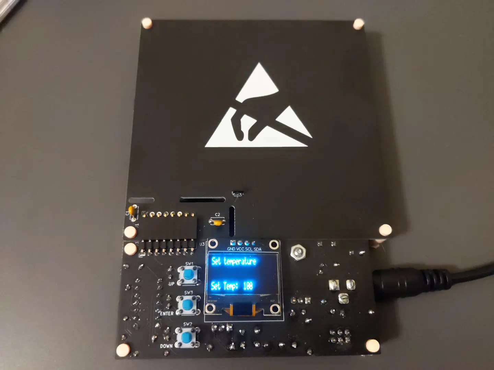

# THT PCB Hot Plate

A modular PCB soldering hot plate using only through hole components

## About

A modular PCB hot plate designed for hot plate soldering. It is designed for SMD
soldering and can go up to 180°C. Made using only through hole components in
order to make it easy to build by hobbyists.

## Specifications

- 180°C max temperature
- Microcontroller: Atmel ATTINY84A
- Display: 128x32 pixel SSD1306 or compatible display
- Modular/interchangeable hot plates
- 18-20 volt 2x5.5mm DC input
- 3 button input

## Hardware

### Connectors and Switches

#### J1 - DC Power Input

| Pin | Description   |
| --- | -----------   |
| 1   | +18-20V power |
| 2   | Ground        |
| 3   | Ground        |

#### J2 - ISCP Header

| Pin | Description  |
| --- | -----------  |
| 1   | MISO         |
| 2   | +5V          |
| 3   | SCL          |
| 4   | MOSI         |
| 5   | Reset        |
| 6   | Ground       |

#### J3 - Hot Plate Connector

| Pin | Description         |
| --- | -----------         |
| 1   | NC                  |
| 2   | +18-20V             |
| 3   | +18-20V             |
| 4   | MOSFET drain        |
| 5   | MOSFET drain        |
| 6   | +5V                 |
| 7   | Ground              |
| 8   | Temp. sensor output |

*Note: The J3 connector on the control board is exactly the same as the J1
connector on the hot plate board*

### Bill of Materials

A list of all Digikey parts can be found [here](https://www.digikey.com/en/mylists/list/93WA87OA5L)

#### Control Board

| Type               | Reference | Description                             | Quantity | Source                              |
| ----               | --------- | -----------                             | -------- | ------                              |
| Integrated Circuit | U1        | L7805CV voltage regulator               | 1        | Digikey 497-1443-5-ND               |
| Integrated Circuit | U2        | ATTINY84A-PU microcontroller            | 1        | Digikey ATTINY84A-PU-ND             |
| Display            | U3        | SSD1306 0.96" display                   | 1        | Ebay, AliExpress, and other sources |
| IC Socket          | U2        | DIP-14 300 mil socket                   | 1        | Digikey ED3014-ND                   |
| Diode              | D1, D2    | SD103A                                  | 2        | Digikey SD103AVSCT-ND               |
| Diode              | D3        | 1N5231                                  | 1        | Digikey 1N5231B-ND                  |
| MOSFET             | Q1        | IRLZ44N                                 | 1        | Digikey IRLZ44NPBF-ND               |
| Capacitor          | C1        | 100uF, Electrolytic, 3.5mm lead spacing | 1        | Digikey 732-9187-1-ND               |
| Capacitor          | C2-C4, C8 | 0.1uF, MLCC, 5mm lead spacing           | 4        | Digikey BC2665CT-ND                 |
| Capacitor          | C5-C7     | 3300pF, MLCC, 2.5mm lead spacing        | 3        | Digikey BC1075CT-ND                 |
| Resistor           | R1-R5, R7 | 10kOhm, through hole                    | 6        | Digikey 13-MFR-25FRF52-10KCT-ND     |
| Resistor           | R6        | 30kOhm, through hole                    | 1        | Digikey 13-MFR-25FTE52-30KCT-ND     |
| Resistor           | R8        | 200Ohm, throught hole                   | 1        | Digikey 200XBK-ND                   |
| Tactile Button     | SW1-SW3   | 6mm tactile button                      | 3        | Digikey 450-1654-ND                 |
| DC Jack            | J1        | 2x5.5mm, through hole, right angle      | 1        | Digikey CP-002AH-ND                 |
| Pin Header         | J2        | 6 pin header, 2.54mm pitch, 2x3 pins    | 1        | Digikey 732-5394-ND                 |
| Pin Header         | J3        | 8 pin header, 2.54mm pitch, right angle | 1        | Digikey 2057-PH1RB-08-UA-ND         |

#### Hot Plate

| Type               | Reference | Description                             | Quantity | Source                             |
| ----               | --------- | -----------                             | -------- | ------                             |
| Integrated Circuit | U1        | LMT87LPGM temperature sensor            | 1        | Digikey 296-LMT87LPGMCT-ND         |
| Capacitor          | C1, C2    | 0.1uF, MLCC, 5mm lead spacing           | 2        | Digikey BC2665CT-ND                |
| Pin Socket         | J1        | 8 pin header, 2.54mm pitch, right angle | 1        | Digikey S5483-ND                   |

## License

Source code is licensed under the GPLV3 or later.
Everything else is licensed under the CERN-OHL-W-2.0.
